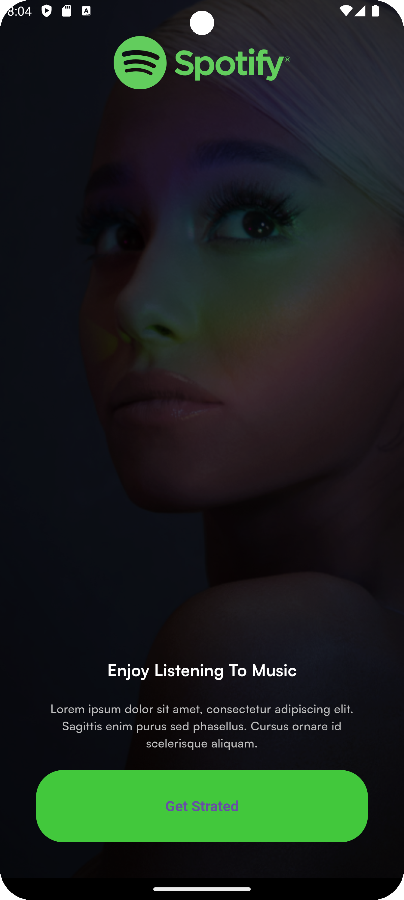
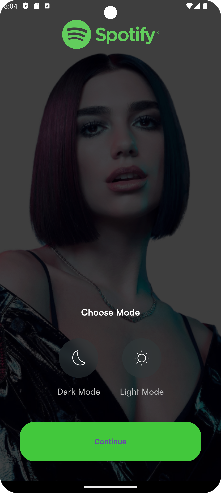
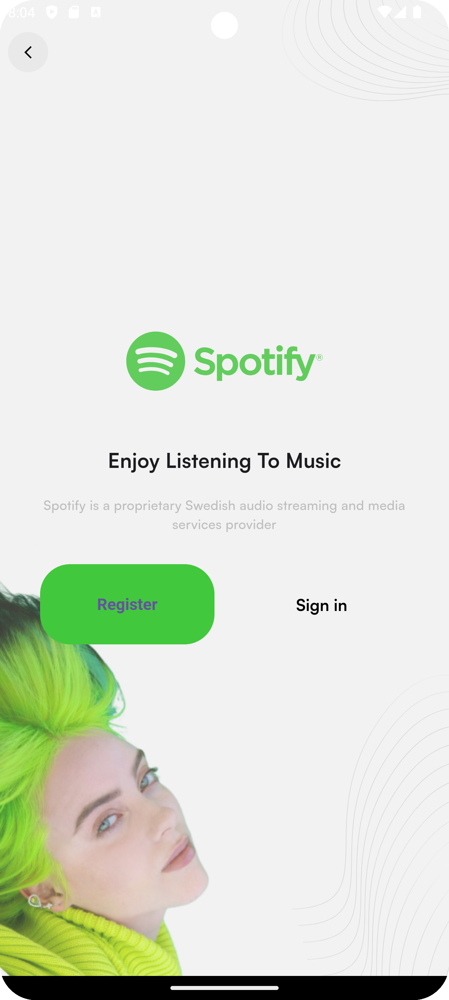
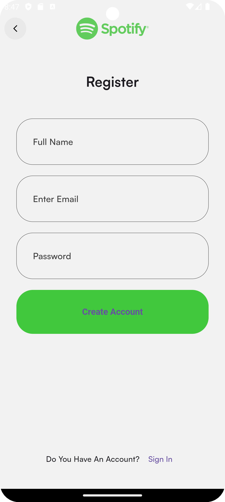
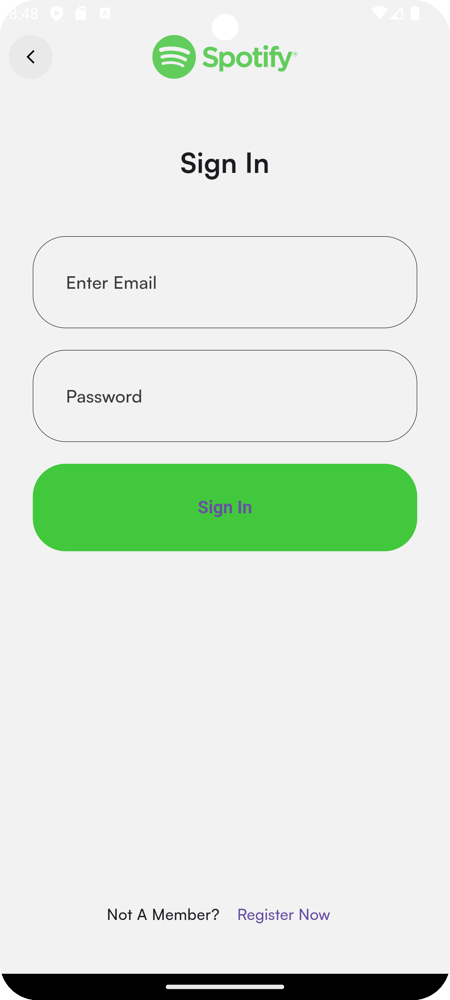
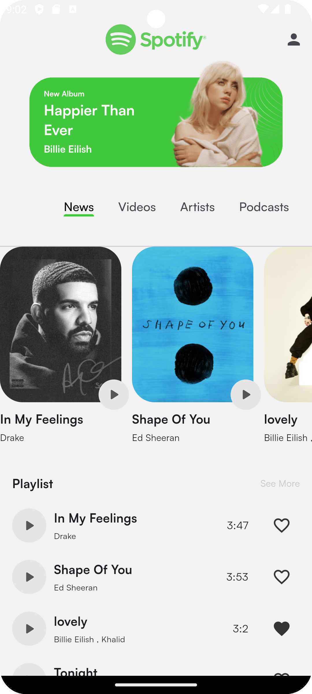
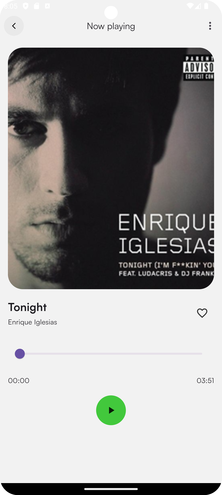
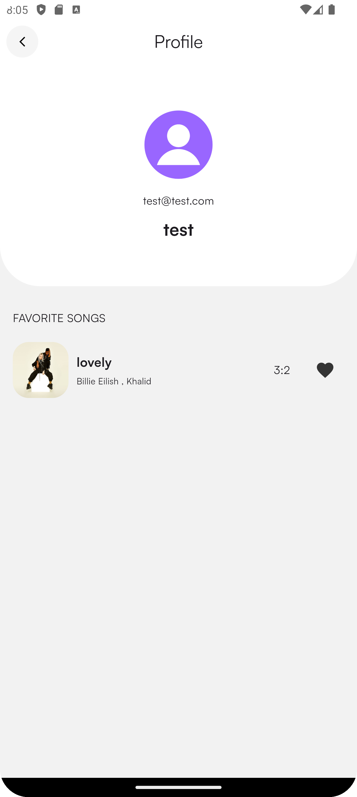

# Spotify

This is a Spotify clone app built based on the **Spotify Redesign - Free UI Kit** from Figma Community. It leverages **BLoC** for state management, **Firebase** for authentication and data storage, and **Clean Architecture** to ensure better code maintainability.

## Features

- **User Authentication**: Sign up and login using email and password via Firebase Authentication.
- **Music Playback**: Stream available songs in the app.
- **Favorites**: Mark songs as favorites for easy access.

## Screenshots

  
  
  
  
  
  
  
  

